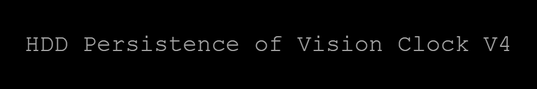

<!--maybe add some badges here?-->

#### 
HDD converted into a persistence of vision mechanical display clock

V4.0 Prototypte:

<!--gif of the protytpe-->
   

      

---
---

## Project Explanation
The front face of a HDD is removed exposing the internals. The platters are replaced with a stationary LED board and a spinning light mask. The LED board sits against the HDD frame, stationary. The light mask is mounted to the HDD motor.

There is an IR reflective sensor mounted on the LED board that keeps track of an index point on the bottom of the light mask.

The light mask spins quickly, the processor on the Driver Board monitors the sensor and tracks the period of time it takes for a full rotation. The LEDs can then be controlled with precise timing to allow light to escape the holes in the light mask when the light mask is at its desired rotational angle. Doing this quickly enough can trick the eye into seeing an image. This is called <a href="https://en.wikipedia.org/wiki/Persistence_of_vision" target="_blank" rel="noreferrer noopener">_persistence of vision_</a>.

There are 2 types of light masks that I have designed. 
* The _first_ uses a slit going from the center of the platter to the edge. This allows me to draw lines radiating from the center of the display. I use this mask to draw an analog clock.

    

* The _second_ uses what is known as a <a href="https://en.wikipedia.org/wiki/Nipkow_disk" target="_blank" rel="noreferrer noopener">_Nipkow Disk_</a>. This is a disk that has holes spiraling from the center at a constant interval. Each of these holes can then be used to draw pixels on the display. Each hole corresponds to a horizontal line on the display, the vertical pixels are then placed by rotating the light mask and pulsing a backight. One light mask has 8 holes, the other has 12.

    

    

*Light masks are PCBs. Actual ordered PCBs have black solder mask. V4 clock uses the same light masks as V3.

---

## Hardware Breakdown
This project is a clock that uses a hard drive to create a persistence of vision display.

The project has 2 PCBs
* <a href="https://github.com/TickingClocks/HDD-Persistence-of-Vision-Clock_V4/tree/main/Electrical/Driver%20Board" target="_blank" rel="noreferrer noopener">_Driver Board_</a>
    * This board replaces the original PCB.
    * The Driver Board has an <a href="https://www.st.com/en/microcontrollers-microprocessors/stm32f411.html" target="_blank" rel="noreferrer noopener">_STM32F411_</a> ARM M4 processor running at 100MHz. The driver board controls the whole system from the motor driver chip, LEDs, Temperature sensors, human interface, etc.

    

* <a href="https://github.com/TickingClocks/HDD-Persistence-of-Vision-Clock_V4/tree/main/Electrical/LED%20Board" target="_blank" rel="noreferrer noopener">_LED Board_</a>
    * This board replaces the bottom platter in the HDD. A 3D printed spacer is used to elevate the light mask, which replaces the second platter.
    * The LED board contains 116 <a href="http://www.led-color.com/upload/201604/APA102-2020%20SMD%20LED.pdf" target="_blank" rel="noreferrer noopener">_APA102-2020_</a> LEDs in a circular pattern. It also has an <a href="https://ams-osram.com/products/sensors/position-sensors/osram-reflective-interrupter-sfh-9206" target="_blank" rel="noreferrer noopener">_IR reflective sensor_</a> which can be used to either track a shiny pad on the light mask, or the absence of one, depending on the light mask used. The LED board also has a board mounted temperature sensor.

    

The electrical connections between the PCBs are made between spring-loaded header pins mounted on the driver board and contact points on the back of the LED board.

---

## What’s Next?
I'm currently developing this project in my spare time. Updates will probably come in batches.

* Hardware
    * [ ] <a href="https://github.com/TickingClocks/HDD-Persistence-of-Vision-Clock_V4/tree/main/Electrical/Driver%20Board" target="_blank" rel="no referrer noopener">_Driver Board V4.1_</a>
        * [x] choose new motor driver chip
        * [x] choose new DC jack
        * [x] Fix SPI lines
        * [x] fix via placements
        * [x] fix air temp sensor routing
        * [x] fix motor connector orientation
        * [x] update IR sensor signal resistors
        * [x] order PCBs and parts
        * [ ] assemble PCB
        * [ ] test hardware
    * [ ] <a href="https://github.com/TickingClocks/HDD-Persistence-of-Vision-Clock_V4/tree/main/Electrical/LED%20Board" target="_blank" rel="no referrer noopener">_LED Board V4.0_</a>
        * [x] pick new IR reflective sensor
        * [x] order PCBs and parts
        * [ ] assmble PCB
        * [ ] test hardware

* Firmware
    * Devices
        * [x] temperature sensors
        * [x] real time clock
        * [x] LEDs
        * [ ] motor driver chip (V4.1)
    * Persistence of vision (basic)
        * [x] slit light mask
        * [ ] Nipkow Disk
